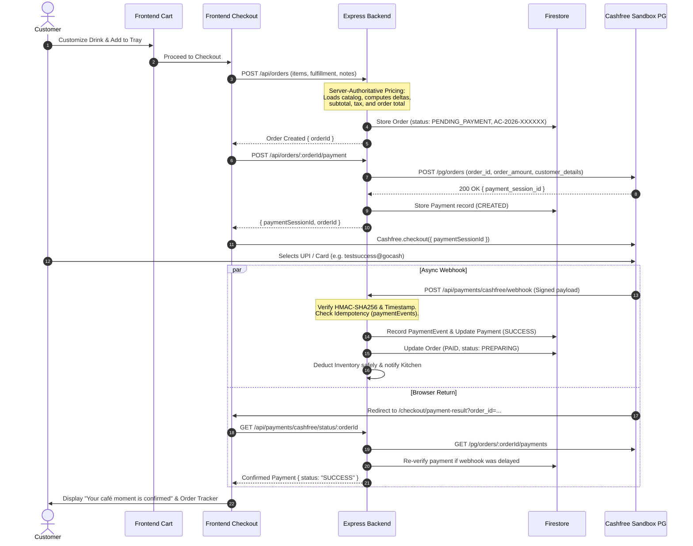

# Cashfree Payments Sandbox Integration Architecture (Phase 8)

> **AI CAFÉ — Your Drink. Your Way.**  
> **Environment:** Cashfree Payments Sandbox (`SANDBOX ONLY`)  
> **API Version:** `2025-01-01`  
> **Provider Abstraction:** `PaymentService` -> `CashfreeProvider`

---

## 1. Overview & Core Principles

Phase 8 integrates Cashfree Payments in **Sandbox Mode** to provide a seamless, secure, and production-grade payment flow for AI Café.

### Architectural Tenets:
1. **Server-Authoritative Pricing**: The frontend client never dictates product prices, customization costs, subtotals, or order totals. All calculations occur strictly on the backend referencing the Firestore product and ingredient catalog.
2. **Strict Credential Isolation**: The Cashfree Secret Key (`CASHFREE_SECRET_KEY`) exists exclusively within the backend runtime environment (`backend/.env`). It is never passed to frontend bundles, exposed in responses, or logged.
3. **Cryptographic Webhook Verification**: All webhook notifications from Cashfree must pass HMAC-SHA256 signature verification (`x-webhook-signature`, `x-webhook-timestamp`) with an enforced 10-minute replay attack window.
4. **Strict Idempotency**: All webhook events and status checks are stored in a dedicated `paymentEvents` collection. Duplicate delivery of a success event is detected and handled harmlessly without duplicate kitchen dispatch or duplicate inventory deductions.
5. **Inventory Safety**: Stock is deducted **only** upon verified, authoritative payment success. Neither cart creation, pending checkout, nor failed transactions alter inventory levels.

---

## 2. Environment Configuration

### Backend Environment (`backend/.env`)
All Cashfree credentials and runtime configurations are managed through environment variables validated by Zod at startup (`backend/src/config/env.ts`):

```bash
# Cashfree Payments Gateway (Sandbox Environment)
CASHFREE_ENVIRONMENT=sandbox
CASHFREE_APP_ID=TEST_APP_ID_PLACEHOLDER
CASHFREE_SECRET_KEY=TEST_SECRET_KEY_PLACEHOLDER
CASHFREE_API_VERSION=2025-01-01
```

> [!CAUTION]
> **Secret Key Protection**:
> - Never hardcode or commit `CASHFREE_SECRET_KEY`.
> - Never prefix with `NEXT_PUBLIC_` or reference in `src/` (frontend).
> - `APIKey.csv` downloaded from Cashfree merchant dashboard is gitignored and must never be committed or parsed programmatically.

---

## 3. System Architecture & Provider Abstraction

Payment gateways are decoupled from core business operations via the `IPaymentProvider` interface:

```
                  +-----------------------------------+
                  |          OrderService             |
                  +-----------------+-----------------+
                                    |
                                    v
                  +-----------------------------------+
                  |         PaymentService            |
                  |  (Idempotency, DB, Inventory)     |
                  +-----------------+-----------------+
                                    |
            +-----------------------+-----------------------+
            |                                               |
            v                                               v
+-----------------------+                       +-----------------------+
|   CashfreeProvider    |                       |    FutureProvider     |
|   (Sandbox / Prod)    |                       |    (Razorpay/Stripe)  |
+-----------------------+                       +-----------------------+
```

### `IPaymentProvider` Interface (`backend/src/types/payment.ts`)
- `createPaymentOrder(params: CreatePaymentParams): Promise<PaymentOrderResult>`
- `getPaymentStatus(orderId: string): Promise<PaymentVerificationResult>`
- `verifyWebhook(rawBody: string, signature: string, timestamp: string): Promise<WebhookVerificationResult>`

---

## 4. End-to-End Payment Flow



---

## 5. Webhook Security & Idempotency

### Signature Verification Algorithm
Cashfree webhooks transmit:
- Header: `x-webhook-signature` (Base64-encoded HMAC-SHA256 digest)
- Header: `x-webhook-timestamp` (Epoch millisecond string)

The signature payload is:
```
timestamp + rawBody
```
Verified against `CASHFREE_SECRET_KEY` using constant-time comparison (`crypto.timingSafeEqual`) to prevent timing attacks.

### Replay Attack Prevention
Timestamps older than 10 minutes (`600,000 ms`) or drifted into the future by more than 1 minute are rejected with `400 Bad Request`.

### Raw Body Preservation
In `backend/src/app.ts`, `express.json()` captures the unparsed raw buffer in `req.rawBody`. The body sanitization middleware bypasses `/api/payments/cashfree/webhook` to preserve the cryptographic byte integrity.

### Idempotency Enforcement
Each webhook event has a unique reference ID (`data.payment.cf_payment_id` or event timestamp hash). The backend checks the `paymentEvents` collection:
- If event reference already processed: immediately acknowledges with HTTP 200 `{ success: true, alreadyProcessed: true }`.
- Zero duplicate database writes, zero duplicate inventory deductions.

---

## 6. State Machine Specifications

### Internal Payment States (`PaymentStatus`)
- `CREATED`: Initial payment record created with payment session.
- `PENDING`: User engaged with payment gateway; awaiting confirmation.
- `SUCCESS`: Authorized and confirmed payment received.
- `FAILED`: Gateway rejected transaction or test failure triggered.
- `CANCELLED`: User cancelled at checkout modal.
- `REFUNDED`: Payment refunded.

### Internal Order States (`OrderStatus`)
- `PENDING_PAYMENT`: Initial order state prior to payment verification.
- `PAID`: Payment verified by backend.
- `PREPARING`: Transmitted to kitchen queue for barista crafting.
- `READY`: Drink crafted and waiting on collection counter.
- `COMPLETED`: Handed over to customer.
- `CANCELLED`: Order cancelled.

> [!NOTE]
> Payment state and order status are decoupled. An order in `PREPARING` or `READY` retains its `PAID` payment state.

---

## 7. Inventory Safety

Inventory is guarded by the following invariants:
1. **Never deduct on intent**: Merely adding drinks to the cart, starting checkout, or opening Cashfree Web Checkout never touches stock.
2. **Never deduct on failure**: Cancelled or failed payments do not decrement ingredients.
3. **Unit Conversion**: Base ingredients are stocked in liters (`l`) and kilograms (`kg`), while drink recipes specify milliliters (`ml`) and grams (`g`). Deductions divide by 1000 before updating Firestore.
4. **Double-Deduction Lock**: Orders track `inventoryDeducted: true`. If webhook delivery repeats or status re-checks occur, inventory deduction is bypassed.

---

## 8. Sandbox Testing Guide

### Official Cashfree Test Instruments

#### 1. UPI Testing (Recommended for fastest flows)
- **Success UPI ID**: `testsuccess@gocash` (Triggers immediate payment success)
- **Failure UPI ID**: `testfailure@gocash` (Simulates bank failure / insufficient funds)
- **Invalid UPI ID**: `testinvalid@gocash` (Simulates invalid VPA)

#### 2. Card Testing
- **Test Card Number**: Cashfree Sandbox test cards (e.g., standard 16-digit test cards with any future expiry date and 3-digit CVV `123`).
- **OTP**: Enter any 6-digit OTP on the Cashfree simulation screen.

#### 3. Net Banking
- Select any Sandbox mock bank (HDFC, ICICI, SBI) and click "Success" on the simulated bank portal.

---

## 9. Switching from Sandbox to Production

When transitioning to production:

1. Obtain live credentials from the Cashfree Merchant Dashboard.
2. Update backend environment variables in production host (e.g. Render / Cloud Run):
   ```bash
   CASHFREE_ENVIRONMENT=production
   CASHFREE_APP_ID=<LIVE_APP_ID>
   CASHFREE_SECRET_KEY=<LIVE_SECRET_KEY>
   CASHFREE_API_VERSION=2025-01-01
   ```
3. Update frontend SDK initialization mode in `src/features/payments/cashfree-checkout.ts` to `production` when `process.env.NEXT_PUBLIC_PAYMENT_ENV === 'production'`.
4. Configure live Webhook URL in Cashfree Dashboard:
   `https://<your-backend-domain>/api/payments/cashfree/webhook`
   Subscribed events: `PAYMENT_SUCCESS_WEBHOOK`, `PAYMENT_FAILED_WEBHOOK`, `PAYMENT_USER_DROPPED_WEBHOOK`.
5. No backend code rewrite is necessary—the architecture dynamically switches endpoints based on `CASHFREE_ENVIRONMENT`.
